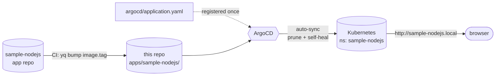

# devops-challenge-gitops

Source of truth for what runs in the cluster. ArgoCD watches `apps/sample-nodejs/` and reconciles every change automatically. CI in the [app repo](https://github.com/IdoShoshani/sample-nodejs) promotes a release by `yq`-bumping `image.tag` here — no `kubectl` in CI, no cluster credentials in CI; the git history of this repo *is* the deploy audit log.

## Architecture



## Bring it up

**Prereqs**

```bash
kubectl config current-context     # any cluster you control
kubectl get ingressclass nginx     # must return an IngressClass named "nginx"
```

**1. Install ArgoCD**

```bash
kubectl create namespace argocd
kubectl apply -n argocd --server-side --force-conflicts \
  -f https://raw.githubusercontent.com/argoproj/argo-cd/stable/manifests/install.yaml
kubectl -n argocd wait --for=condition=available deploy/argocd-server --timeout=4m
```

**2. Register this private repo with ArgoCD**

Needs a fine-grained PAT scoped to this repo with **Contents: Read** (ArgoCD only clones; the CI bot does the writes).

```bash
read -s -p "GITOPS_PAT: " PAT && echo
kubectl -n argocd create secret generic gitops-repo \
  --from-literal=type=git \
  --from-literal=url=https://github.com/IdoShoshani/devops-challenge-gitops.git \
  --from-literal=username=IdoShoshani \
  --from-literal=password="$PAT"
kubectl -n argocd label secret gitops-repo argocd.argoproj.io/secret-type=repository
unset PAT
```

**3. Create the app namespace + apply the Application**

```bash
kubectl create namespace sample-nodejs
kubectl apply -f argocd/application.yaml
```

**4. Wait until ArgoCD reports it healthy**

```bash
kubectl -n argocd get application sample-nodejs \
  -o jsonpath='{.status.sync.status} {.status.health.status}'; echo
# expected: Synced Healthy
```

**5. Reach the app via the Ingress**

```bash
# Point sample-nodejs.local at any node IP on the cluster's network.
echo "<node-ip> sample-nodejs.local" | sudo tee -a /etc/hosts

# macOS routes .local through mDNS, so curl/browsers may hang — use --resolve.
curl --resolve sample-nodejs.local:80:<node-ip> http://sample-nodejs.local/my-app
# -> Hello, World!
```

## What's in this repo

| Path | Purpose |
|---|---|
| `apps/sample-nodejs/Chart.yaml` | Chart metadata (maintainers, sources, version, appVersion). |
| `apps/sample-nodejs/values.yaml` | All knobs. CI's `promote` rewrites `image.tag` here on every release. |
| `apps/sample-nodejs/templates/` | Deployment (probes, securityContext, /tmp emptyDir), Service, Ingress, ConfigMap, Secret, `_helpers.tpl`. |
| `argocd/application.yaml` | ArgoCD `Application`: auto-sync, prune, self-heal, retry, ServerSideApply, cascade-delete finalizer. |

- **Why the prose docs live in `values.yaml`'s header:** the `promote` job uses `yq -i` which reflows YAML and strips blank lines. Keeping documentation at the top of the file means yq leaves it alone.

## Operating it

**Force ArgoCD to pick up a new commit immediately** *(default poll is 3 minutes)*

```bash
kubectl -n argocd annotate application sample-nodejs \
  argocd.argoproj.io/refresh=hard --overwrite
```

**Roll back to the previous deploy**

Every `promote` commit is one rollback unit.

```bash
git revert <bump-commit-sha>
git push
# ArgoCD reconciles back to the previous image.tag within minutes
```

**Switch to a private Docker Hub repo**

Edit `apps/sample-nodejs/values.yaml`:

```yaml
imagePullSecrets:
  - name: dockerhub-pull-secret
```

Then create the secret in the app namespace:

```bash
kubectl -n sample-nodejs create secret docker-registry dockerhub-pull-secret \
  --docker-server=https://index.docker.io/v1/ \
  --docker-username=<user> --docker-password="$DOCKERHUB_TOKEN"
```

**Disable auto-sync temporarily** *(for a hand-applied hotfix)*

```bash
kubectl -n argocd patch application sample-nodejs --type merge \
  -p '{"spec":{"syncPolicy":{"automated":null}}}'
# Re-enable by re-applying argocd/application.yaml.
```

## Repo layout

```
devops-challenge-gitops/
├── apps/sample-nodejs/
│   ├── Chart.yaml                 # chart metadata
│   ├── values.yaml                # CI bumps image.tag here; header explains every key
│   ├── .helmignore
│   └── templates/
│       ├── _helpers.tpl            # name/fullname/chart/labels helpers
│       ├── deployment.yaml         # probes, hardened securityContext, preStop drain, RollingUpdate
│       ├── service.yaml
│       ├── ingress.yaml            # nginx ingressClassName; commented TLS placeholder
│       ├── configmap.yaml
│       └── secret.yaml
├── argocd/
│   └── application.yaml           # finalizer + retry + ServerSideApply syncOption
├── .gitignore
└── README.md
```

## Links

- **App repo (source + CI):** https://github.com/IdoShoshani/sample-nodejs
- **Image:** https://hub.docker.com/r/idoshoshani123/sample-nodejs
- **Live (home-lab cluster):** http://sample-nodejs.local/my-app

> macOS note: `.local` is reserved for mDNS — `curl` and browsers may hang on resolution. Workaround: `curl --resolve sample-nodejs.local:80:<node-ip> http://sample-nodejs.local/...`.
